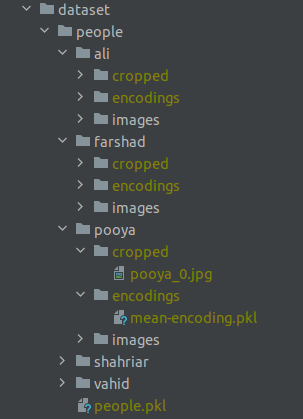
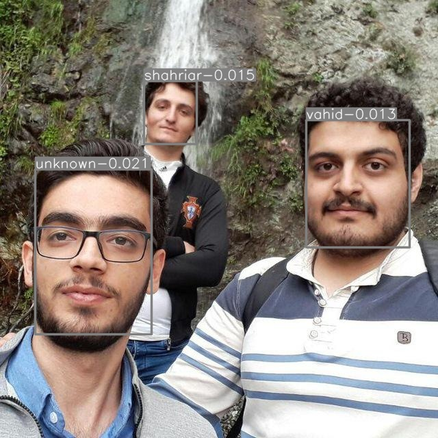

# Face-Detection-Recognition

This project presents a full process of creating face-detection & face-recognition web-application service using 
`deep_utils` library.

The following modules and models are used in the project:
```
1. pytorch
2. flask
3. docker
4. docker-compose
5. nginx
6. face-detection: ultra-light
7. face-recognition: vggface2-senet50
```

# Dataset

The dataset should a directory of images that should be like follows:

```
├── dataset
│   ├──people
│   │   ├── person-1
│   │   │  ├──images
│   │   │  │  ├──image-name-1.jpg
│   │   │  │  ├──image-name-2.jpg
│   │   │  │  ├──...
│   │   ├── person-2
│   │   │  ├──images
│   │   │  │  ├──image-name-1.jpg
│   │   │  │  ├──image-name-2.jpg
│   │   │  │  ├──...
│   │   ├──...
...
```

dataset images are as follows:

<table align="center">
  <tr>
    <td align="center">
      <a href="#">
        <br>
        <sub>
          <b>Ali</b>
        </sub>
      </a>
    </td>
    <td align="center">
      <a href="#">
        <br>
        <sub>
          <b>Farshad</b>
        </sub>
      </a>
    </td>
    <td align="center">
      <a href="https://github.com/pooya-mohammadi">
        <br>
        <sub>
          <b>Pooya</b>
        </sub>
      </a>
    </td>
    <td align="center">
      <a href="#">
        <br>
        <sub>
          <b>Sahriar</b>
        </sub>
      </a>
    </td>
    <td align="center">
      <a href="#">
        <br>
        <sub>
          <b>Vahid</b>
        </sub>
      </a>
    </td>
  </tr>
</table>

Notes:

1. person-name should be the name or ssn-id of the people that will be recognized.
2. image-names are arbitrary and can be anything.

## Preparation:

run the following code to prepare the dataset

```commandline
python data_preparation.py --dataset_dir dataset/people
```

By running the above code, faces of images will be cropped and saved in `cropped` folders under `people/person-names`.
In addition, the encoding of each person is extracted and saved in `people/encodings`. Finally, a single file called
`people.pkl` is created in `people` directory which contains a dictionary of names and encodings which will, eventually,
used to recognize persons in a video. The output should be like the following picture.



# API
To set up api first one need to download the weights.
```commandline
cd api/app/weights
./get_weights.sh
```

File `people.pkl` should be copied from `dataset/people/people.pkl` to `api/app/weights/people.pkl`. The file exists for
the sample dataset.

## Run the project:
1. using docker & docker-compose...
```commandline
cd api
docker-compose up --build
```
2. Using python codes:
```commandline
cd api/app
python entry_point.py
```

## Send a request:
1. using `curl` request:
```commandline
(echo -n '{"image": "'; base64 ./dataset/test/friends.jpg; echo '"}') | curl -H "Content-Type: application/json" -d @-  http://127.0.0.1:8000/face_recognition
```
output:
```commandline
{"face_00":["shahriar",0.016,[177.10394287109375,448.4017333984375,364.7297668457031,599.50244140625]],"face_01":["unknown",0.024,[250.45748901367188,50.30693817138672,483.1863098144531,222.37037658691406]],"face_02":["unknown",0.021,[115.46611785888672,210.6558837890625,209.75440979003906,288.85455322265625]]}

```

2. Using `clinet.py`:
```commandline
python api/client.py --end_point http://127.0.0.1:8000/face_recognition --img_address ./dataset/test/friends.jpg 
```
output: 




# References:
1. https://github.com/pooya-mohammadi/deep_utils
2. https://github.com/Linzaer/Ultra-Light-Fast-Generic-Face-Detector-1MB
3. https://github.com/cydonia999/VGGFace2-pytorch.git